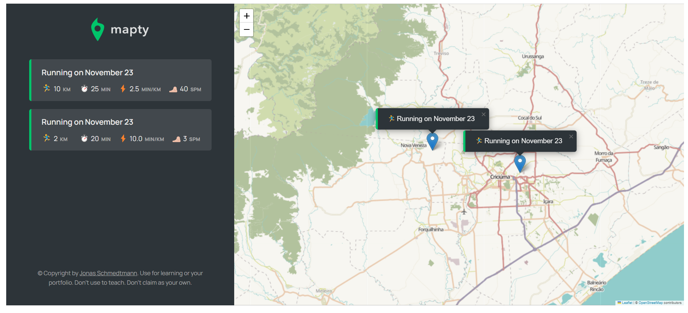

# Mapty

link com a deploy do site: https://maatheuus.github.io/Mapty/

- Esse projeto foi criado para marcar suas corridas ou voltas de bicicletas com a localização do usuário. Projeto feito para aprendizado e desenvolvimento. Pensado pelo instrutor Jonas Schmedtmann.

## Imagens do projeto

